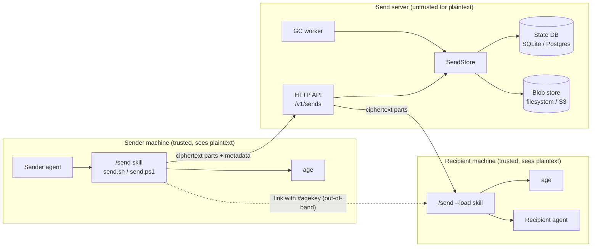
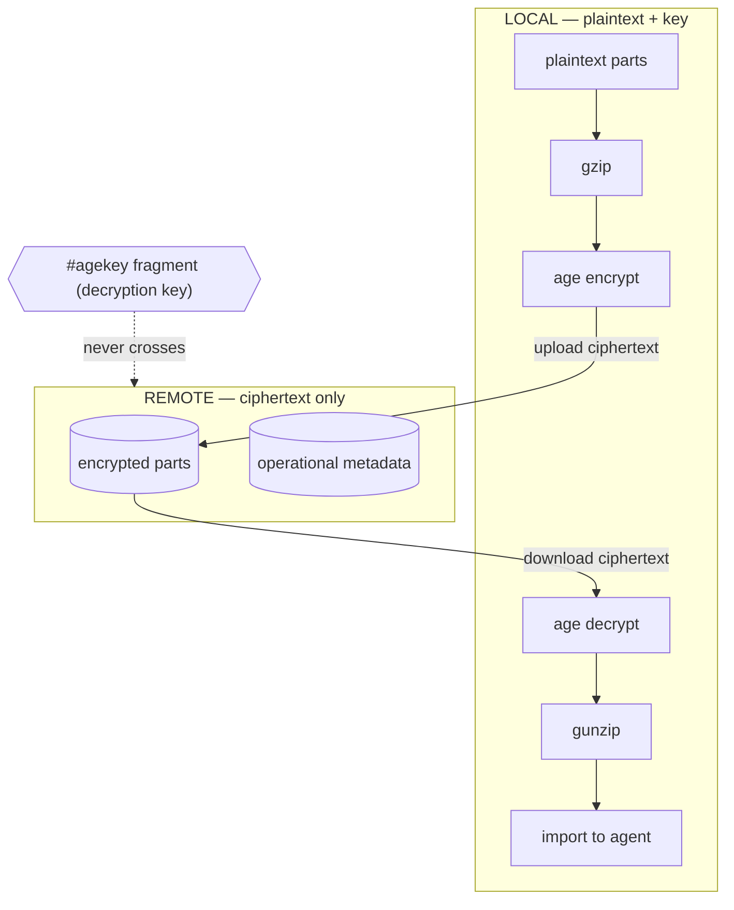
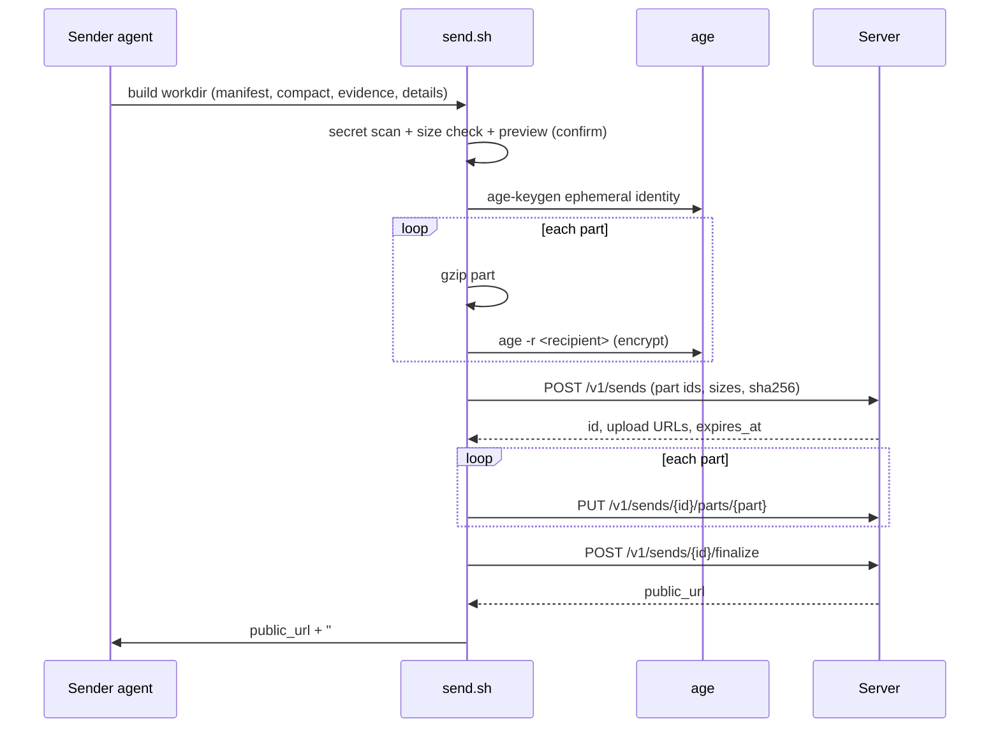
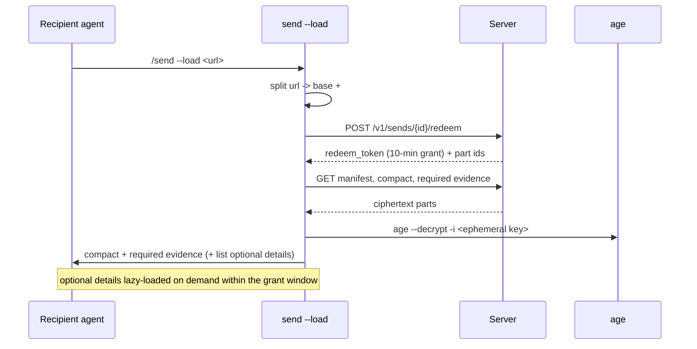
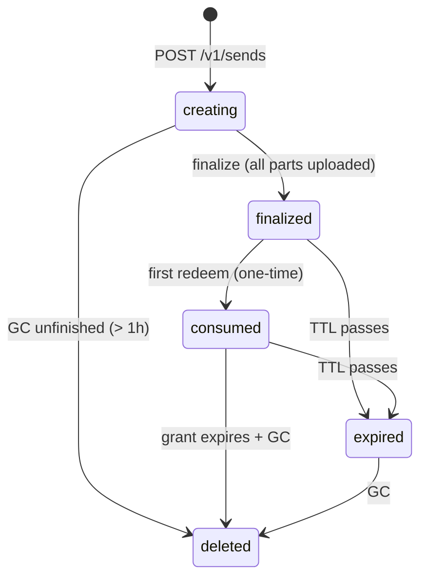

## Overview

Archcore Send moves **structured working context** between AI coding agents as an end-to-end-encrypted **send**. The system has two parts that share nothing but an HTTP API carrying ciphertext:

- **Send skill (client)** — a portable Agent Skill (`SKILL.md` + `send.sh` / `send.ps1`) that builds, encrypts (`age`), uploads, downloads, and decrypts sends. → [[skill-implementation]]
- **Send server (backend)** — a Go single-binary **ciphertext rendezvous**: store/serve encrypted parts, enforce TTL + one-time redemption + limits, run GC. → [[server-implementation]]

**Core invariant:** plaintext and the decryption key exist only on the sender's and recipient's machines. The server holds ciphertext + minimal operational metadata. See [[zero-knowledge-backend]] and [[e2ee-link-key-model]].

This document is the architecture hub — component model, trust boundary, the two data flows, the send lifecycle, and the glossary. Normative detail lives in the specs and rules it links.

## Content

### Component model



### Trust boundary

The boundary is the network edge. Everything semantic happens locally; only ciphertext crosses.



### Data flow — `/send`



### Data flow — `/send --load`



### Send lifecycle



### Glossary

| Term | Meaning |
|---|---|
| **send** | The encrypted multipart handoff artifact. ID prefix `snd_`. |
| **part** | An independently gzipped+encrypted unit of a send. |
| **manifest** | Reserved part `manifest`: the encrypted private index mapping opaque part ids → semantic ids/kinds. |
| **public metadata** | The non-secret lifecycle data the server sees (part count, encrypted sizes, sha256, timestamps). |
| **compact** | The required, load-by-default working context (≤ ~8k tokens). |
| **evidence** | Small supporting facts (errors, decisions, file excerpts), loaded by default if small. |
| **detail** | Large optional parts (full diff, logs), never auto-loaded. |
| **redeem** | The single one-time consumption of a send's public link. |
| **grant** | The short-lived (10-min) download session opened by redeem. |
| **link-key mode** | Per-send ephemeral `age` identity; private key carried in the URL fragment. |
| **fragment** | The `#agekey=...` URL part; parsed locally, never sent to the server. |
| **SendStore** | The Go storage interface (state + blob) the server is built around. |

### Where to look

- Contracts: [[send-format]], [[backend-http-api]], [[skill-contract]], [[error-catalog]]
- Rules: [[security-privacy]], [[content-policy]], [[size-limits]]
- Build: [[skill-implementation]], [[server-implementation]], [[self-host-deploy]]
- Conventions & packaging: [[repo-layout-and-skill-packaging]], [[go-server-conventions]], [[skill-scripting-conventions]], [[testing]]
- Risk: [[threat-model]]

## Examples

Condensed end-to-end handoff:

```text
# Sender
User: /send --ttl 24h
Agent: builds compact context (goal, state, hypothesis, files, decisions,
       open questions, next steps) + selected evidence. Shows preview.
Preview: compact 38 KB · evidence 64 KB · optional full-diff 1.9 MB ·
         skipped pnpm-lock.yaml, coverage/, .env · server receives ciphertext only.
Proceed? y
=> https://send.example.com/s/snd_01J...#agekey=AGE-SECRET-KEY-...  (expires 24h, one-time)

# Recipient
User: /send --load https://send.example.com/s/snd_01J...#agekey=AGE-SECRET-KEY-...
Agent: Loaded "Staging auth failure handoff".
       Goal, relevant files (src/auth/session.ts, src/middleware/jwt.ts),
       open questions imported. Available details: detail.full-diff, detail.test-output.
       I will not modify files until you confirm.
```