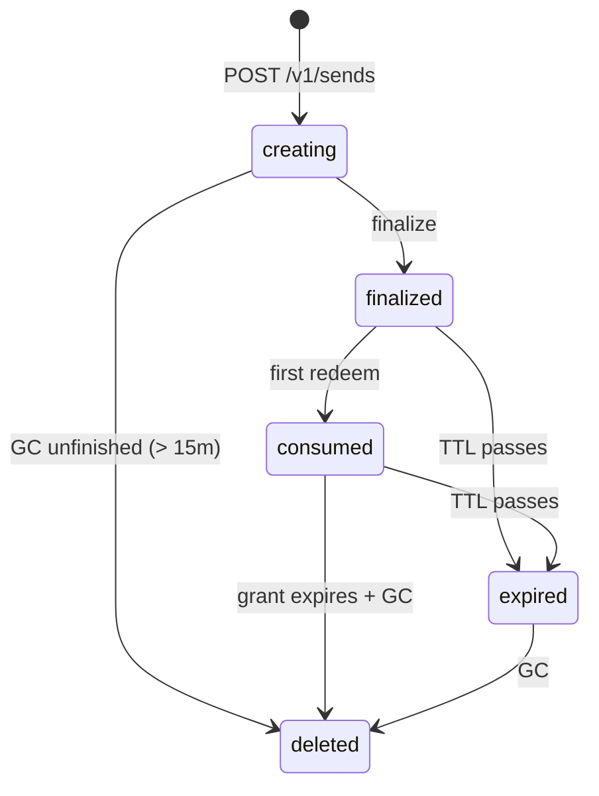
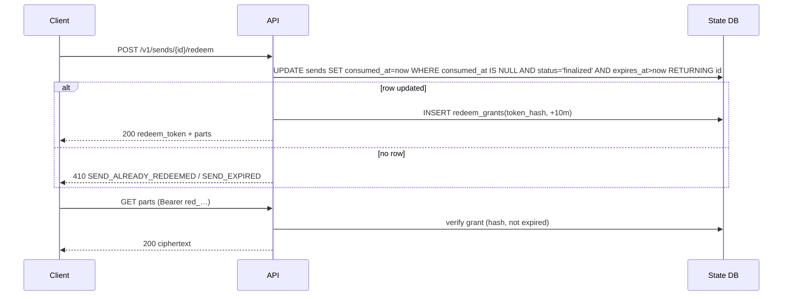

## Purpose

Normative HTTP contract between the Send skill and the Send server under `/v1`. Storage-agnostic and zero-knowledge: payloads are opaque ciphertext plus minimal metadata. Keywords per RFC 2119.

## Scope

Endpoints, request/response schemas, headers, status codes, lifecycle, redemption semantics, auth, and limits. Error bodies/codes are in [[error-catalog]]; caps in [[size-limits]]; the format in [[send-format]].

## Normative Behavior

### Conventions
- Base path `/v1`. JSON for metadata; `application/octet-stream` for part bytes.
- Send ids: `snd_` + sortable random (ULID-style), unguessable. Public URL `…/s/{id}`.
- The URL **fragment is never part of any request** ([[security-privacy]]).
- Auth v0: anonymous link mode — the unguessable id + `#agekey` fragment is the capability. When `SEND_TEAM_TOKEN` is set (self-host team mode), the **write** endpoints (create, upload, finalize) MUST carry `Authorization: Bearer <team-token>`, compared in constant time; missing or wrong → `401 UNAUTHORIZED`. Read/redeem/download stay anonymous — the redeem grant is their gate, so the team token MUST NOT be sent on those.

### Endpoints

**Health** — `GET /healthz` → `200 {"ok":true}`.

**Create** — `POST /v1/sends`
```json
{ "version":"send.v1", "one_time":true, "ttl_seconds":86400,
  "parts":[ {"part_id":"manifest","encrypted_size":1200,"sha256":"..."},
            {"part_id":"part_0001","encrypted_size":28412,"sha256":"..."} ] }
```
→ `201`
```json
{ "id":"snd_01J...",
  "upload_urls":{ "manifest":"/v1/sends/snd_01J.../parts/manifest",
                  "part_0001":"/v1/sends/snd_01J.../parts/part_0001" },
  "public_url":"https://send.example.com/s/snd_01J...",
  "expires_at":"2026-06-12T12:00:00Z", "one_time":true }
```
Server MUST validate `ttl ≤ max`, each `encrypted_size ≤ cap`, `part_count ≤ max` → else `400`/`413`. In team mode it MUST reject before validation with `401` when the team token is absent/wrong. Status becomes `creating`.

**Upload part** — `PUT /v1/sends/{id}/parts/{part_id}`, body = ciphertext, headers `Content-Type: application/octet-stream`, `X-Send-Ciphertext-Sha256: <hex>`.
→ `200 {"ok":true,"part_id":"part_0001","encrypted_size":28412}`
- Server MUST reject a missing or malformed `X-Send-Ciphertext-Sha256` (not 64 hex chars) with `400 BAD_REQUEST` before reading the body.
- Server MUST verify byte count + sha256 vs declared; mismatch → `422 INTEGRITY_FAILED`.
- Idempotent: identical re-PUT (same sha256) MUST succeed.
- Upload to a non-`creating` send → `409`.
- No semantic headers (kind/required) are accepted ([[zero-knowledge-backend]]).

**Finalize** — `POST /v1/sends/{id}/finalize` → `200 {"ok":true,"public_url":"…/s/{id}","expires_at":"…"}`
- Requires all declared parts present; else `400 INCOMPLETE`. Status → `finalized`. Client appends `#agekey=…` locally.

**Get public metadata** — `GET /v1/sends/{id}` → `200` public-metadata object ([[send-format]]). No bytes, no semantics. `404` if unknown/deleted.

**Redeem (one-time)** — `POST /v1/sends/{id}/redeem`
→ `200 { "redeem_token":"red_…", "expires_at":"…(+10m)", "parts":[{"part_id":"manifest","encrypted_size":1200}, …] }`
- First redeem MUST atomically set `consumed_at` (conditional update). Subsequent → `410 SEND_ALREADY_REDEEMED`.
- Expired → `410 SEND_EXPIRED`; not finalized → `409`; unknown → `404`.
- The server stores only the **hash** of `redeem_token` ([[security-privacy]]).

**Download part** — `GET /v1/sends/{id}/parts/{part_id}` with `Authorization: Bearer red_…` → `200 application/octet-stream` ciphertext.
- The grant MUST be sent as a Bearer header only — it is never accepted as a query parameter, so it cannot leak via proxy access logs, browser history, or Referer headers.
- Requires a valid, unexpired grant; else `403 INVALID_REDEEM`. Within the grant, any part may be fetched repeatedly (supports lazy details) until expiry.

**Delete / revoke (optional)** — `DELETE /v1/sends/{id}` with a management token, only if mgmt mode is enabled. v0 omits it; management/revoke is out of scope.

### Lifecycle


### Redemption sequence


### Limits & abuse
Enforce caps from [[size-limits]]; rate-limit by IP on writes **and** on redeem/download/metadata; reject oversize bodies `413`; no directory listing; unguessable ids only; reject unexpected content types.

## Constraints
- The server MUST NOT receive or log the URL fragment, redeem tokens (store hashed), the team token, or request bodies ([[security-privacy]]).
- Presigned object-storage URLs, if used, MUST be issued only **post-redeem** with a very short TTL and MUST NOT bypass one-time semantics.

## Invariants
- **INV-1** — A finalized one-time send transitions to `consumed` at most once (atomic).
- **INV-2** — Part bytes download only with a valid, unexpired grant.
- **INV-3** — Stored ciphertext sha256 == declared sha256.
- **INV-4** — No endpoint accepts or returns plaintext or semantic part metadata.
- **INV-5** — In team mode, no send is created, no part is uploaded, and no send is finalized without a valid team token.

## Error Handling
Statuses used: `400, 401, 403, 404, 409, 410, 413, 422, 429, 500`. Full mapping in [[error-catalog]].

## Conformance
- [ ] atomic redeem holds under concurrent requests;
- [ ] TTL + one-time enforced;
- [ ] sha256 verified on upload;
- [ ] fragment never required server-side;
- [ ] metadata carries no semantics;
- [ ] team mode gates create/upload/finalize and leaves redeem/download anonymous;
- [ ] GC deletes expired + consumed sends.